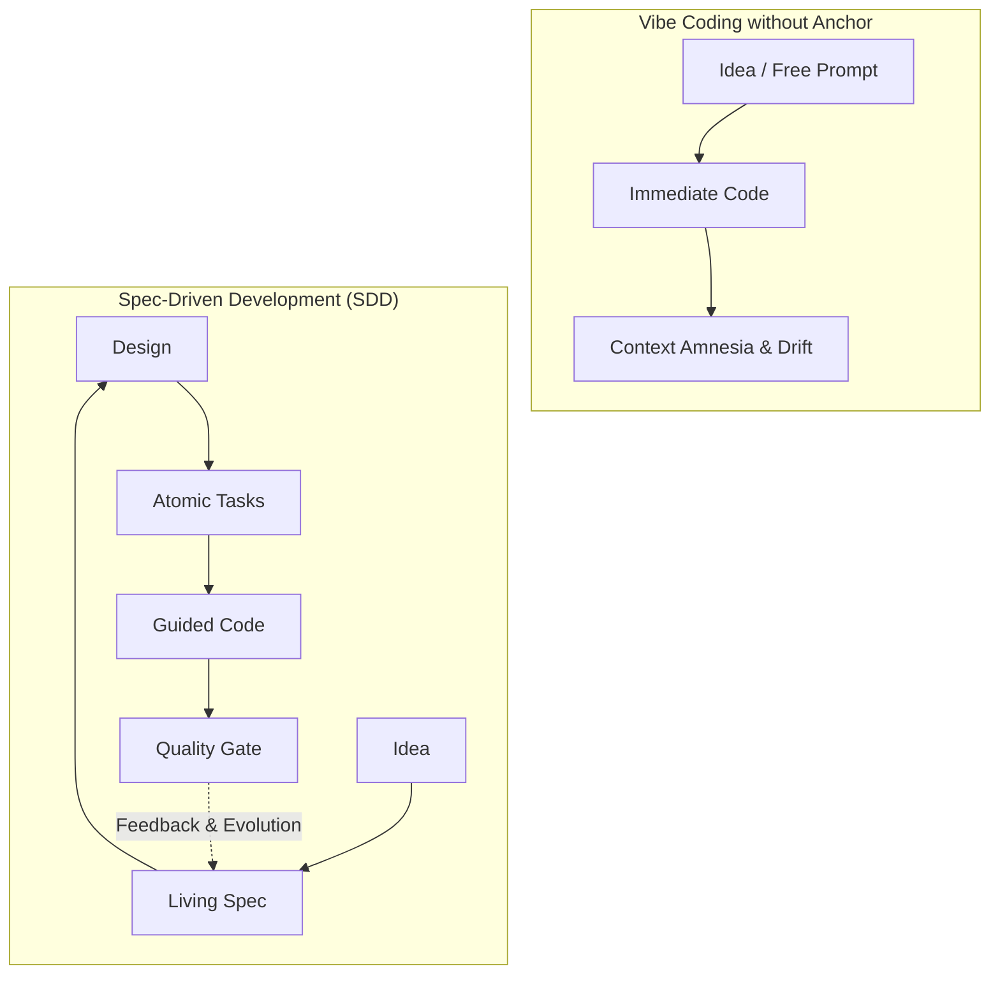
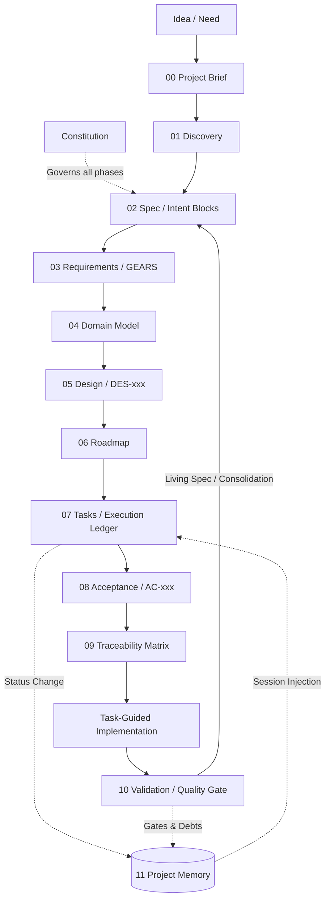

# Spec-Driven Development (SDD) — The Canonical Standard

> **The specification is the source of truth. Code must express it, never replace it.**

[](#the-11-non-negotiable-principles-p1-to-p11)
[](#)
[](#official-implementations)
[](#official-implementations)
[](./LICENSE)

> 🇧🇷 [Leia em Português](./README.md)

---

## Where We Come From: The Natural Evolution of Vibe Coding

***Vibe coding*** — programming by conversing directly with AI models in free-form, iterative flow — is one of the most exciting and revolutionary experiences in modern software engineering. It unlocked unprecedented creative speed.

However, any developer who has tried to scale a medium or large project through free dialogue alone has encountered familiar pain points:

1. **Silent intent drift**: The AI generates plausible, elegant, working code — that subtly deviates from the actual business rule. Without a clear specification, this mismatch goes unnoticed and is only discovered in production.
2. **The opposite extreme of Waterfall**: The temptation to revert to the waterfall model — spending weeks writing massive documents before coding — is rigid and incompatible with the pace of AI. **SDD is definitively not Waterfall**.
3. **Context amnesia between chats**: Opening a new session and having to "re-explain the project from scratch," watching the AI hallucinate schemas or reinvent already-existing functions.
4. **Lack of milestone gates**: Continuing to build new screens on unstable foundations, without structured pauses to audit whether the delivered code actually meets the plan.
5. **Tasks that are too large**: Requesting complete features in a single prompt, resulting in truncated code and implicit architectural decisions.

**Spec-Driven Development (SDD)** does not exist to slow down the dynamism of AI-assisted development — **it is the seatbelt and roadmap of vibe coding**. SDD channels that speed around a central, lightweight, versioned artifact: the **living specification**.



---

## The 11 Non-Negotiable Principles (P1 to P11)

| # | Principle | Operational Meaning |
|:---:|:---|:---|
| **P1** | **The specification is the source of truth** | Requirement changed? The change starts in the spec, never in the code. |
| **P2** | **Constitution before specification** | Non-negotiable global rules (quality, testing, security, architecture) live in `constitution.md` and govern all phases. |
| **P3** | **The specification must be alive** | The spec evolves continuously with the software. An outdated spec is dead weight. |
| **P4** | **End-to-end traceability** | Mandatory chain: `Objective (Intent) → Requirement (GEARS) → Design Decision (DES) → Task (TASK) → Acceptance Criteria (AC) → Test → Code`. Materialized in `09-traceability.md`. |
| **P5** | **Requirements must be verifiable** | Vague terms ("fast," "robust," "simple") are forbidden; they must become observable metrics (SLAs, response times, status codes). |
| **P6** | **Ambiguity addressed early** | Gaps are never filled by assumption. Undefined items are explicitly marked `PENDING DEFINITION` and logged as risks. |
| **P7** | **Design before execution** | Architecture, components, integrations, and justified trade-offs are formalized before any line of code. |
| **P8** | **Tasks derive from artifacts** | No programming task is created in a vacuum; every item in the task ledger traces back to a requirement or design decision. |
| **P9** | **Continuous validation (Quality Gates)** | The spec is validated before design; design before tasks; code before closing a milestone. Quality gates block progress with critical open issues. |
| **P10** | **SDD is not Waterfall** | Specify just enough to eliminate ambiguity, implement incrementally, learn, and consolidate the spec back. |
| **P11** | **State outside the chat (Context Engineering)** | AI chat sessions are volatile and undergo compaction. ALL state, tasks, and project memory live in versioned files on disk. |

---

## Canonical Syntax

Pure SDD rigorously separates the capture of **business intent** from the **formalization of behavior**.

### 1. Intent Block — Captures the WHY
Used in Discovery, Epics, and Executive Vision (`00-project-brief.md`, `02-spec.md`, and `proposal.md`):

```text
Intent Block:
Goal:        Reduce rework caused by incorrect manual registrations.
Expectation: Register customers with automatic validation and zero document duplication.
Action:      Transactional registration flow with instant uniqueness validation.
Result:      Customer ready and immediately available to the sales team.
```

### 2. GEARS (Generalized EARS) — Formalizes WHAT must happen
Based on Alistair Mavin's EARS methodology and generalized for AI agents by the SubLang project. Defines observable behavior with precise, testable syntax.

> **Canonical Rule:** GEARS keywords are **always in English**, even when the body text is in another language.

```text
[Where <static precondition: environment, flag, configuration>]
[While <dynamic precondition: system runtime state>]
[When <trigger or input event>]
the <subject: service, module, or actor> shall <observable behavior>.
```

#### Examples:
```text
When the sales user submits a customer registration form with valid data,
the customer service shall create a new customer record.

Where multi-factor authentication is enabled,
when the user submits valid primary credentials,
the authentication service shall request a second authentication factor.

While the account is locked,
when a login request is submitted,
the authentication service shall reject the request with code AUTH-042.
```

---

## Artifact Architecture & Lifecycle

The complete flow is governed by the **Constitution** and materialized in the `docs/sdd/` tree:



### Artifact Maturity

Every SDD artifact follows an explicit maturity lifecycle:

```text
Draft  →  Reviewed  →  Approved
  ↑                       |
  └── Change via Delta ───┘
```

- **Draft**: First version generated by the agent. May contain gaps marked as `PENDING DEFINITION`.
- **Reviewed**: The user reviewed, asked questions, and the agent adjusted. Critical gaps were resolved.
- **Approved**: The user explicitly approved. The artifact can be used as a basis for deriving subsequent ones.

No phase advances on artifacts that have not reached at least `Reviewed`. Quality Gates (P9) validate consistency between phases.

### Continuous Evolution via Delta Specs
After the initial baseline (greenfield), the central specification is not rewritten directly. Changes evolve through **Delta Specs**:

```text
changes/<change-name>/
  ├── proposal.md     # Motivation (Why), Scope, and Success Criteria
  ├── delta-spec.md   # Only the delta: ADDED / MODIFIED / REMOVED sections in GEARS
  └── tasks.md        # Atomic task ledger for the change
```

**3-State Machine:**
1. **`proposal`**: Proposal reviewed and approved by the user before any code.
2. **`apply`**: Execution strictly oriented by the change's tasks.
3. **`archive`**: The delta is audited, consolidated into the central spec, and archived in `archive/`.

---

## Official Implementations (Tooling Hub)

Pure SDD is agnostic. The operationalization of the method is distributed through native plugins developed for the major agentic development tools:

| Tool / Platform | Repository | Description |
|:---|:---|:---|
| **Google Antigravity IDE** | [`sdd-antigravity`](https://github.com/sdd-standard/sdd-antigravity) | Official plugin for the Google Gemini ecosystem. On-demand skills, shielded validator subagent, memory hooks in PreInvocation, and native rules. |
| **Claude Code (Anthropic)** | [`sdd-claude`](https://github.com/sdd-standard/sdd-claude) | Official plugin for Claude Code via CLI and VS Code. Model routing (Opus for architecture, Sonnet for code/validation), hooks, and ID guards. |

---

## Comparison with Other Frameworks

SDD is the set of essential principles; several open-source projects operationalize facets of the model:

| Capability | Pure SDD | GitHub Spec Kit | OpenSpec | BMAD-METHOD |
|:---|:---:|:---:|:---:|:---:|
| Constitution / Global Principles | ✅ | ✅ | — | ✅ |
| Spec as Source of Truth | ✅ | ✅ | ✅ | ✅ |
| End-to-End Traceability | ✅ | ✅ | ✅ | — |
| Design before Code | ✅ | ✅ | — | ✅ |
| Tasks as Ledger | ✅ | ✅ | ✅ | ✅ |
| Continuous Validation (Quality Gates) | ✅ | ✅ | — | — |
| Delta Specs (Incremental Evolution) | ✅ | — | ✅ | — |
| State outside the Chat (P11) | ✅ | — | — | ✅ |
| Formal Syntax (GEARS) | ✅ | — | — | — |
| Native Multi-Agent Plugins | ✅ | — | — | — |

- **GitHub Spec Kit (`github/spec-kit`)**: Excellent guided flow via sequential commands (`/specify`, `/plan`, `/tasks`, `/implement`).
- **OpenSpec (`Fission-AI/openspec`)**: Pioneer in the minimalist Delta Specs model (`specs/` vs `changes/`).
- **BMAD-METHOD**: Structures work into engineering personas (PM, Architect, Scrum Master, QA) with context transfer in story files.
- **sdd-claude & sdd-antigravity**: The reference implementers of **Pure SDD**, combining the rigor of quality gates, canonical GEARS syntax, and deterministic session persistence.

---

## How to Contribute

Want to adapt SDD for another assistant (Cursor, Roo Code, Copilot Workspace, Windsurf)?  
Check the contribution guide in [`CONTRIBUTING.md`](./CONTRIBUTING.md) and submit an RFC or new tooling adapter.

---

## License

This standard and its specifications are distributed under the [MIT](./LICENSE) license.
