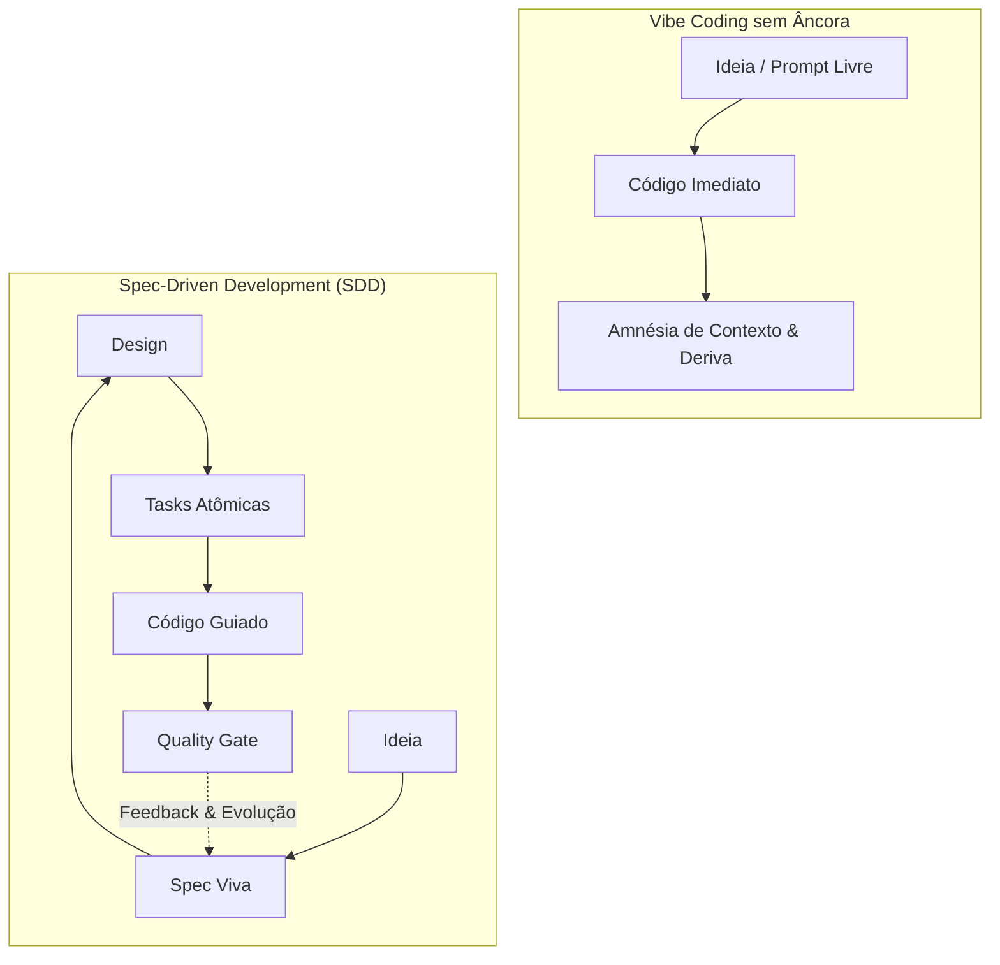
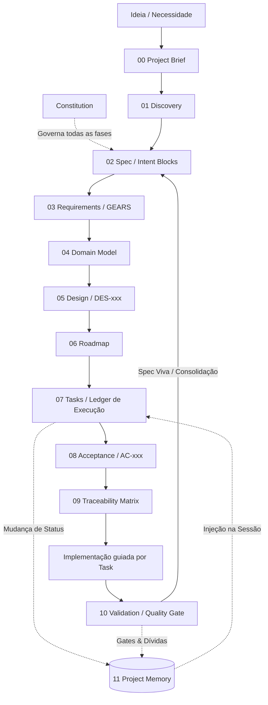

# Spec-Driven Development (SDD) — O Padrão Canônico

> **A especificação é a fonte da verdade. O código deve expressá-la, nunca substituí-la.**

[](#princípios-fundamentais-p1-a-p11)
[](#)
[](#implementações-oficiais)
[](#implementações-oficiais)
[](./LICENSE)

> 🇺🇸 [Read in English](./README.en.md)

---

## De Onde Viemos: A Evolução Natural do Vibe Coding

O ***vibe coding*** — programar conversando diretamente com modelos de IA em fluxo livre e iterativo — é uma das experiências mais empolgantes e revolucionárias da engenharia de software moderna. Ele desbloqueou uma velocidade criativa sem precedentes.

No entanto, qualquer desenvolvedor que tenta escalar um projeto médio ou grande apenas no diálogo livre já se deparou com dores conhecidas:

1. **A deriva de intenção silenciosa**: A IA gera um código plausível, elegante e funcional, mas que desvia sutilmente da regra de negócio real. Sem uma especificação clara, esse descompasso passa despercebido e só é descoberto em produção.
2. **O extremo oposto do *Waterfall***: A tentação de voltar ao modelo cascata — passar semanas escrevendo documentos gigantes antes de codificar — é engessada e incompatível com o ritmo da IA. **SDD definitivamente não é Waterfall**.
3. **A amnésia de contexto entre chats**: Abrir uma nova sessão e ter que "reexplicar o projeto do zero", assistindo à IA alucinar schemas ou reinventar funções já existentes.
4. **Falta de portões (*gates*) por milestone**: Continuar construindo novas telas sobre bases instáveis, sem pausas estruturadas para auditar se o código entregue realmente atende ao que foi planejado.
5. **Tarefas grandes demais**: Pedir funcionalidades completas em um único prompt, resultando em códigos truncados e decisões arquiteturais implícitas.

O **Spec-Driven Development (SDD)** não existe para frear o dinamismo do desenvolvimento por IA — **ele é o cinto de segurança e o mapa de bordo do *vibe coding***. O SDD canaliza essa velocidade em torno de um artefato central, leve e versionado: a **especificação viva**.



---

## Os 11 Princípios Inegociáveis (P1 a P11)

| # | Princípio | Significado Operacional |
|:---:|:---|:---|
| **P1** | **A especificação é a fonte da verdade** | O requisito mudou? A mudança começa na spec, nunca no código. |
| **P2** | **Constitution antes da especificação** | Regras globais inegociáveis (qualidade, testes, segurança, arquitetura) residem em `constitution.md` e governam todas as fases. |
| **P3** | **A especificação deve ser viva** | A spec evolui continuamente junto com o software. Spec desatualizada é peso morto. |
| **P4** | **Rastreabilidade de ponta a ponta** | Cadeia obrigatória: `Objetivo (Intent) → Requisito (GEARS) → Decisão de Design (DES) → Tarefa (TASK) → Critério de Aceite (AC) → Teste → Código`. Materializada em `09-traceability.md`. |
| **P5** | **Requisitos devem ser verificáveis** | Termos vagos ("rápido", "robusto", "simples") são proibidos; transformam-se em métricas observáveis (SLAs, tempos, status). |
| **P6** | **Ambiguidade tratada cedo** | Lacunas não são preenchidas por suposição. O que não foi definido vira explicitamente `PENDENTE DE DEFINIÇÃO` e vai para o log de riscos. |
| **P7** | **Design vem antes da execução** | Arquitetura, componentes, integrações e trade-offs justificados são formalizados antes de qualquer linha de código. |
| **P8** | **Tarefas derivam dos artefatos** | Nenhuma tarefa de programação é criada no vácuo; cada item no ledger de tarefas aponta para um requisito ou decisão técnica. |
| **P9** | **Validação contínua (Quality Gates)** | A spec é validada antes do design; o design antes das tasks; o código antes de fechar o milestone. Portões de qualidade barram avanço com pendências críticas. |
| **P10** | **SDD não é Waterfall** | Especifica-se o necessário para eliminar ambiguidades, implementa-se incrementalmente, aprende-se e consolida-se a spec de volta. |
| **P11** | **Estado fora do chat (Engenharia de Contexto)** | Sessões de chat de IA são voláteis e sofrem compactação. TODO o estado, tarefas e memória do projeto vivem em arquivos versionados em disco. |

---

## Sintaxes Canônicas

O SDD Puro separa com rigor a captura de **intenção de negócio** da **formalização de comportamento**.

### 1. Intent Block — Captura o PORQUÊ
Usado no Discovery, Épicos e Visão Executiva (`00-project-brief.md`, `02-spec.md` e `proposal.md`):

```text
Intent Block:
Goal:        Reduzir o retrabalho causado por cadastros manuais incorretos.
Expectation: Cadastrar clientes com validação automática e zero duplicidade de documento.
Action:      Fluxo de cadastro transacional com validação instantânea de unicidade.
Result:      Cliente apto e disponível imediatamente para o time comercial.
```

### 2. GEARS (Generalized EARS) — Formaliza O QUE deve acontecer
Baseado na metodologia EARS de Alistair Mavin e generalizado para agentes de IA pelo projeto SubLang. Define o comportamento observável com sintaxe precisa e testável.

> **Regra Canônica:** As palavras-chave do GEARS são **sempre em inglês**, mesmo com o corpo do texto em português.

```text
[Where <pré-condição estática: ambiente, flag, configuração>]
[While <pré-condição dinâmica: estado de runtime do sistema>]
[When <gatilho ou evento de entrada>]
the <subject: serviço, módulo ou ator> shall <comportamento observável>.
```

#### Exemplos:
```text
When the sales user submits a customer registration form with valid data,
the customer service shall create a new customer record.

Where multi-factor authentication is enabled,
when the user submits valid primary credentials,
the authentication service shall request a second authentication factor.

While the account is locked,
when a login request is submitted,
the authentication service shall reject the request with code AUTH-042.
```

---

## Arquitetura de Artefatos & Ciclo de Vida

O fluxo completo é governado pela **Constitution** e materializado na árvore `docs/sdd/`:



### Maturidade dos Artefatos

Todo artefato SDD segue um ciclo de maturidade explícito:

```text
Draft  →  Reviewed  →  Approved
  ↑                       |
  └── Mudança via Delta ──┘
```

- **Draft**: Primeira versão gerada pelo agente. Pode conter lacunas marcadas como `PENDENTE DE DEFINIÇÃO`.
- **Reviewed**: O usuário revisou, fez perguntas e o agente ajustou. Lacunas críticas foram resolvidas.
- **Approved**: O usuário aprovou explicitamente. O artefato pode ser usado como base para derivar os seguintes.

Nenhuma fase avança sobre artefatos que não atingiram pelo menos `Reviewed`. Quality Gates (P9) validam a consistência entre fases.

### Evolução Contínua via Delta Specs
Após o baseline inicial (greenfield), a especificação central não é reescrita diretamente. Mudanças evoluem via **Delta Specs**:

```text
changes/<nome-da-mudanca>/
  ├── proposal.md     # Motivação (Why), Escopo e Critérios de Sucesso
  ├── delta-spec.md   # Apenas o delta: seções ADDED / MODIFIED / REMOVED em GEARS
  └── tasks.md        # Ledger de tarefas atômicas da mudança
```

**Máquina de 3 Estados:**
1. **`proposal`**: Proposta revisada e aprovada pelo usuário antes de qualquer código.
2. **`apply`**: Execução orientada estritamente pelas tasks da mudança.
3. **`archive`**: O delta é auditado, consolidado na spec central e arquivado em `archive/`.

---

## Implementações Oficiais (Tooling Hub)

O SDD Puro é agnóstico. A operacionalização do método é distribuída através de plugins nativos desenvolvidos para as principais ferramentas de desenvolvimento agêntico:

| Ferramenta / Plataforma | Repositório | Descrição |
|:---|:---|:---|
| **Google Antigravity IDE** | [`sdd-antigravity`](https://github.com/sdd-standard/sdd-antigravity) | Plugin oficial para o ecossistema Google Gemini. Skills sob demanda, subagente validador blindado, hooks de memória no PreInvocation e regras nativas. |
| **Claude Code (Anthropic)** | [`sdd-claude`](https://github.com/sdd-standard/sdd-claude) | Plugin oficial para Claude Code via CLI e VS Code. Roteamento de modelos (Opus para arquitetura, Sonnet para código/validação), hooks e guardas de IDs. |

---

## Comparativo com Outros Frameworks

O SDD é o conjunto de princípios essenciais; diversos projetos open source operacionalizam facetas do modelo:

| Capacidade | SDD Puro | GitHub Spec Kit | OpenSpec | BMAD-METHOD |
|:---|:---:|:---:|:---:|:---:|
| Constitution / Princípios Globais | ✅ | ✅ | — | ✅ |
| Spec como Fonte da Verdade | ✅ | ✅ | ✅ | ✅ |
| Rastreabilidade Ponta a Ponta | ✅ | ✅ | ✅ | — |
| Design antes do Código | ✅ | ✅ | — | ✅ |
| Tasks como Ledger | ✅ | ✅ | ✅ | ✅ |
| Validação Contínua (Quality Gates) | ✅ | ✅ | — | — |
| Delta Specs (Evolução Incremental) | ✅ | — | ✅ | — |
| Estado fora do Chat (P11) | ✅ | — | — | ✅ |
| Sintaxe Formal (GEARS) | ✅ | — | — | — |
| Plugins Nativos Multi-Agente | ✅ | — | — | — |

- **GitHub Spec Kit (`github/spec-kit`)**: Excelente fluxo guiado por comandos sequenciais (`/specify`, `/plan`, `/tasks`, `/implement`).
- **OpenSpec (`Fission-AI/openspec`)**: Pioneiro no modelo minimalista de Delta Specs (`specs/` vs `changes/`).
- **BMAD-METHOD**: Estrutura o trabalho em personas de engenharia (PM, Architect, Scrum Master, QA) com context transfer em story files.
- **sdd-claude & sdd-antigravity**: Os implementadores de referência do **SDD Puro**, unindo o rigor dos quality gates, syntaxes GEARS canônicas e persistência determinística de sessão.

---

## Como Contribuir

Quer adaptar o SDD para outro assistente (Cursor, Roo Code, Copilot Workspace, Windsurf)?  
Consulte o guia de contribuição em [`CONTRIBUTING.md`](./CONTRIBUTING.md) e submeta uma RFC ou novo adaptador de tooling.

---

## Licença

Este padrão e suas especificações são distribuídos sob a licença [MIT](./LICENSE).
