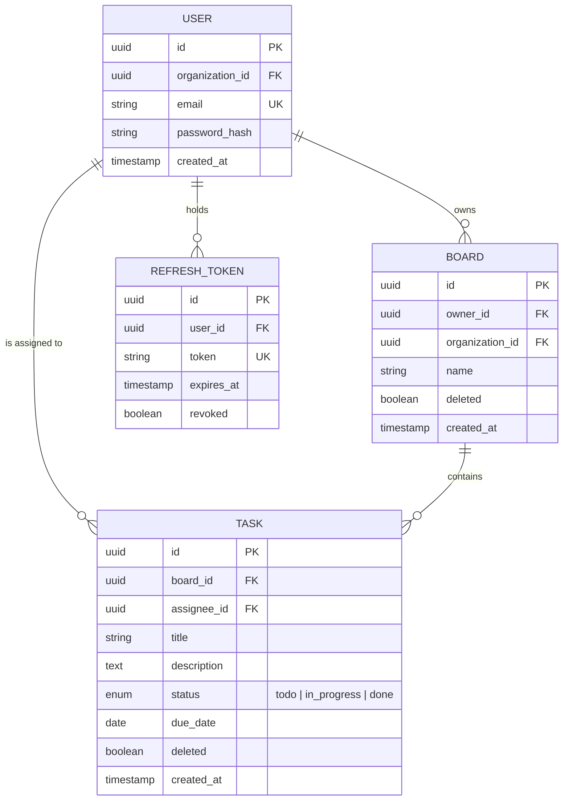

# 04 — Domain Model

## Bounded Contexts

### BC-1: Authentication
Responsible for user identity, credential management, and session tokens.
- **Ubiquitous Language:** User, Credentials, Access Token, Refresh Token, Session.
- **Isolation:** This context owns the `users` and `refresh_tokens` tables. No other context writes to them directly.

### BC-2: Task Management
Responsible for boards, tasks, status lifecycle, and assignment.
- **Ubiquitous Language:** Board, Task, Status (todo, in_progress, done), Assignee, Owner, Due Date.
- **Isolation:** This context owns `boards` and `tasks` tables. It references `users.id` as a foreign key but never reads or writes user credentials.

## Entity Model

## Aggregates
- **User Aggregate:** `User` (root) + `RefreshToken` (child). Invariant: a user can have at most 5 active refresh tokens.
- **Board Aggregate:** `Board` (root) + `Task[]` (children). Invariant: deleting a board soft-deletes all its tasks.

## Value Objects
- **Email:** Validated format (RFC 5322), lowercase-normalized, unique per organization.
- **TaskStatus:** Enum with allowed transitions (`todo` → `in_progress`, `in_progress` → `done`, `in_progress` → `todo`).
