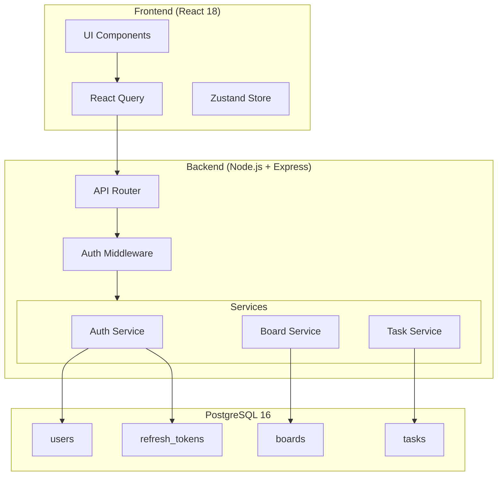

# 05 — Design

## Architecture Overview

## Design Decisions

### DES-001: Stateless JWT Authentication
- **Decision:** Use stateless JWT access tokens (1h expiry) with opaque refresh tokens stored in the database.
- **Rationale:** Stateless JWTs avoid session storage on the server, enabling horizontal scaling. Refresh tokens in the database allow revocation (logout, security breach).
- **Trade-off:** Token revocation for access tokens is not instant (up to 1h window). Acceptable for an internal team tool.
- **Related:** FR-AUTH-003, FR-AUTH-005, FR-AUTH-006.

### DES-002: Soft Delete Strategy
- **Decision:** Boards and tasks use soft-delete (`deleted: boolean`) rather than physical deletion.
- **Rationale:** Prevents accidental data loss. Enables future "trash/recovery" feature without schema changes.
- **Trade-off:** Queries must always filter `WHERE deleted = false`. Mitigated with a database view or default scope.
- **Related:** FR-BOARD-004.

### DES-003: Status Transition Validation in Domain Layer
- **Decision:** Task status transitions are validated in the domain service layer, not via database constraints.
- **Rationale:** Transition rules are business logic (e.g., `todo → in_progress` is allowed, `todo → done` is not). Keeping this in the service layer makes it testable and changeable without migrations.
- **Related:** FR-TASK-004, FR-TASK-005.

### DES-004: Organization ID from Day One
- **Decision:** All tables include `organization_id` even though v1 is single-tenant.
- **Rationale:** Avoids a costly migration when multi-tenancy is added. The application layer enforces single-tenant behavior by injecting a default `organization_id`.
- **Related:** RISK-001 (from 01-discovery.md).

### DES-005: API Error Code Convention
- **Decision:** All error responses follow the format `{ "error": { "code": "<DOMAIN>-<NNN>", "message": "<human-readable>" } }`.
- **Rationale:** Machine-parseable error codes enable frontend-specific error handling without brittle string matching on messages.
- **Related:** FR-AUTH-001, FR-AUTH-002, FR-AUTH-004, FR-BOARD-005, FR-TASK-005, FR-TASK-007.
